# Anjan M | CSE | Batch 28’

<!-- ##  TASK 1 — 3D Printing

### Overview
Learned the fundamentals of 3D printing and the complete workflow from model preparation to printing.

### Key Learnings
- Working principle of 3D printers
- Understanding STL files
- Slicing using Ultimaker
- Printer parameters:
  - Bed temperature, Infill density, Layer height,Print speed
- Printed an STL model under coordinator supervision

--- -->

## TASK 2 — API

### Overview
**What is an API?**  
API stands for Application Programming Interface. Interface can be thought of as a contract of service between two applications. This contract defines how the two communicate with each other using requests and responses.

I created a weather application by integrating an external API to understand real-time data fetching.
[Weather_App](https://weather-api-woad-pi.vercel.app/)

### Project Implementation

###  API Selection
* **Provider:** [Weather_Map](https://openweathermap.org/)
* **Service:** Current Weather Data API
* **Auth Method:** API Key (490a02c5a6858e1729c5b8d361xxxxxx)

###   Features
* **Real-Time Polling:** Fetches live data from global weather stations.
* **Dynamic Backgrounds:** The background image and theme colors change automatically to match the weather condition (Rain, Sun, Clouds, etc.).

### Key learnings
- Studied API concepts and usage
- Used a weather API to fetch live data
- Created a user interface to display results
- Parsed JSON responses and displayed weather details

### API integration 
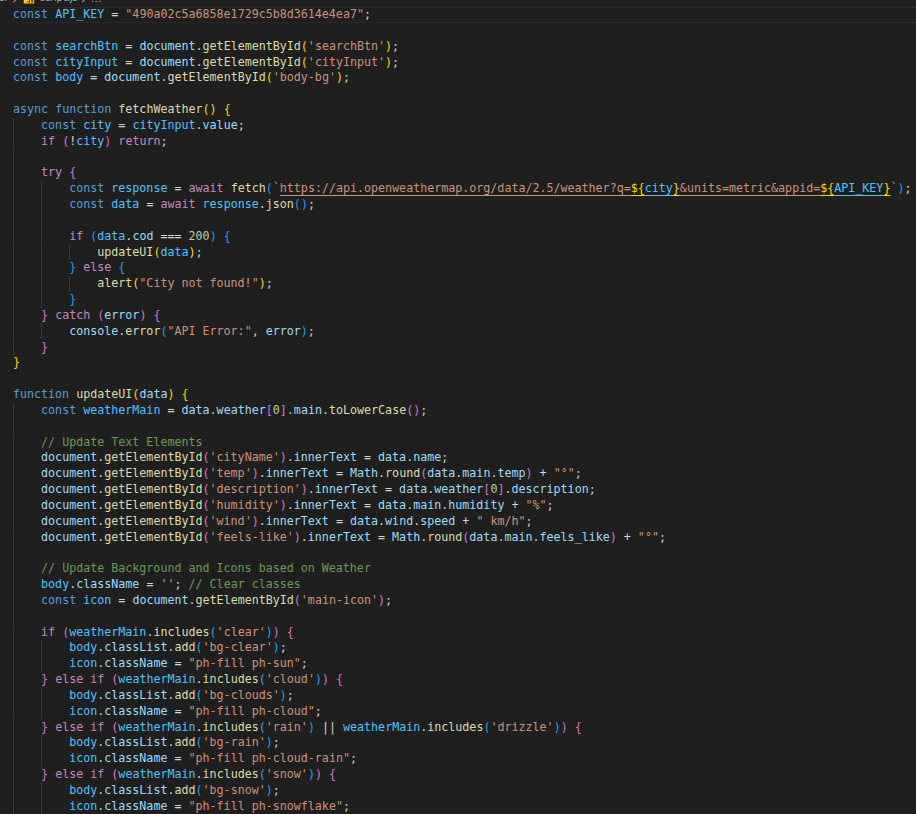
###  Weather API Output
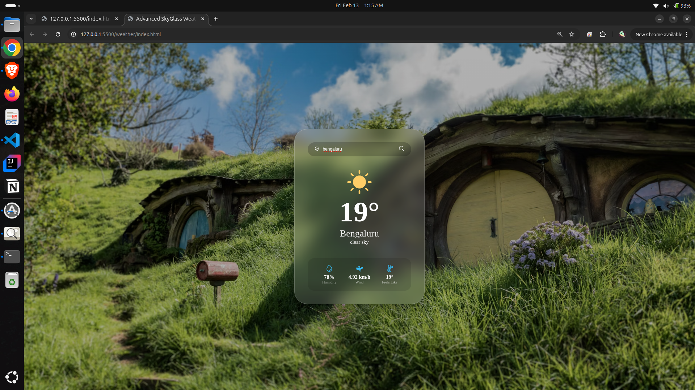

---

## TASK 3 — Working with GitHub

### Overview
Explored collaborative development practices using GitHub.

### Activities
- Worked with branches and pull requests
- Understood GitHub Actions workflows
- Practiced forking and merging code
### Git commands
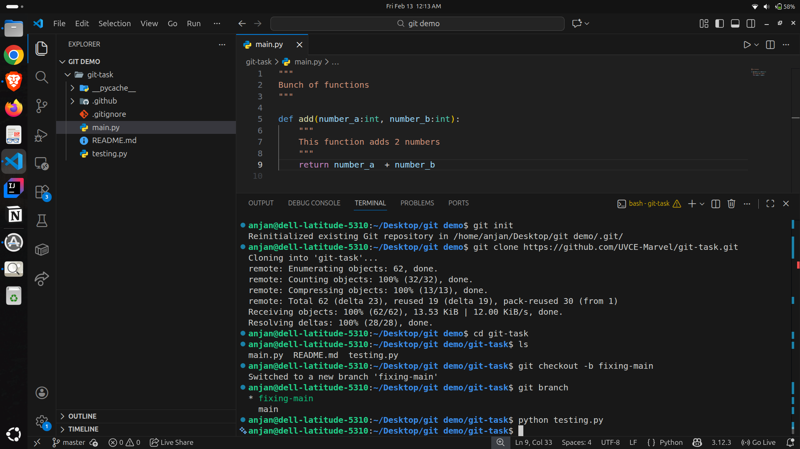
###  Fork
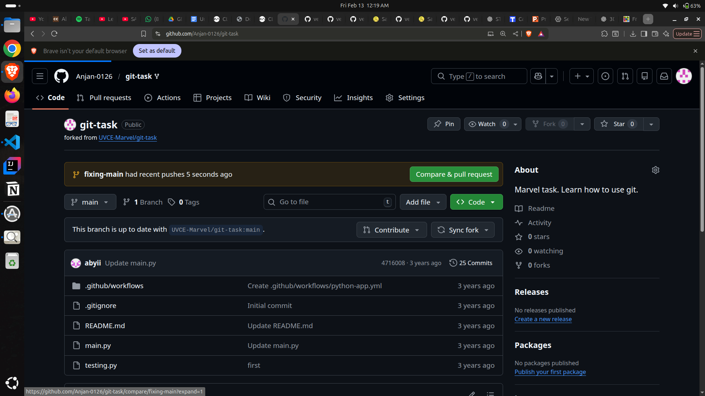
###  Pull request
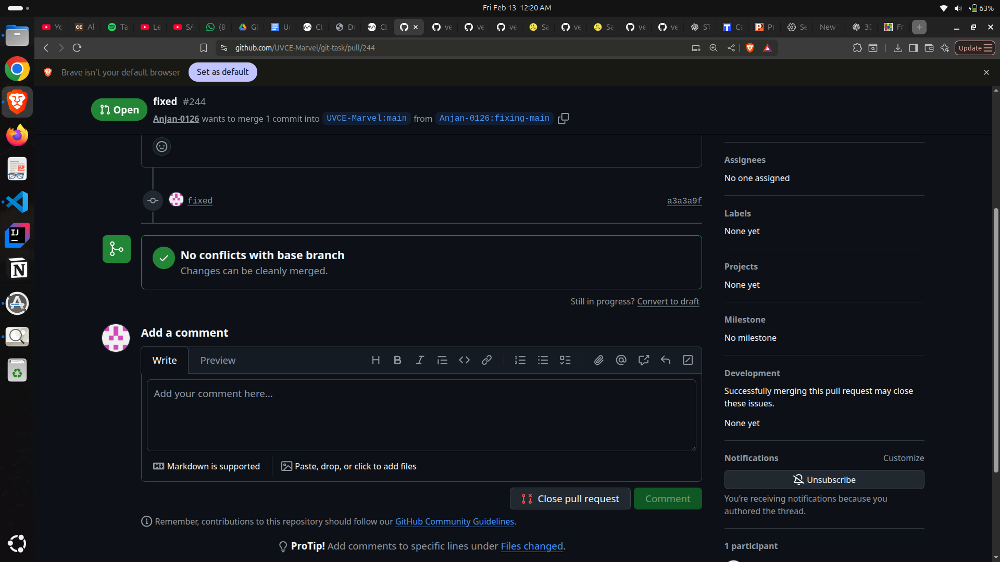

---

##  TASK 4 — Ubuntu Command Line

### Overview
In this task, I worked with the  **Ubuntu command line**  and practiced basic shell commands.  
I successfully completed all the subtasks mentioned.

### Tasks Performed
- Created and navigated directories
- Listed files using terminal commands
- Created files without text editors
- Concatenated text files and displayed output
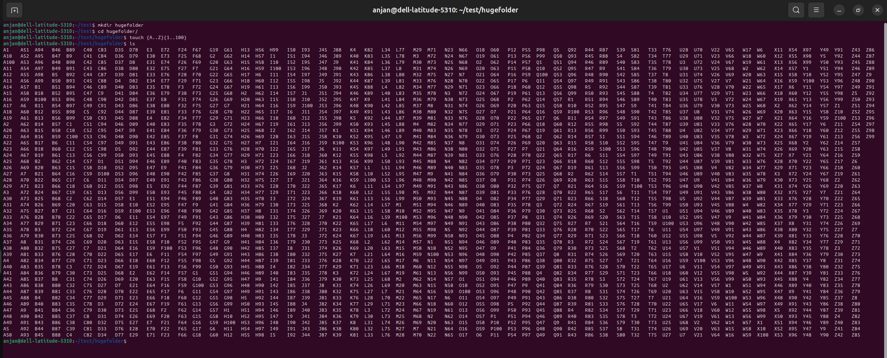
- Generated multiple folders using loops

---

##  TASK 6 — Matrix Puzzle (NumPy & Matplotlib)

### Overview
Decoded a scrambled matrix to reveal a hidden image using NumPy operations.

### Activities
- Loaded the scrambled matrix
- Reshaped encoded array into square format
- Corrected orientation of image
- Visualized final output with Matplotlib
[pyhton_script](numpy/imag.py)
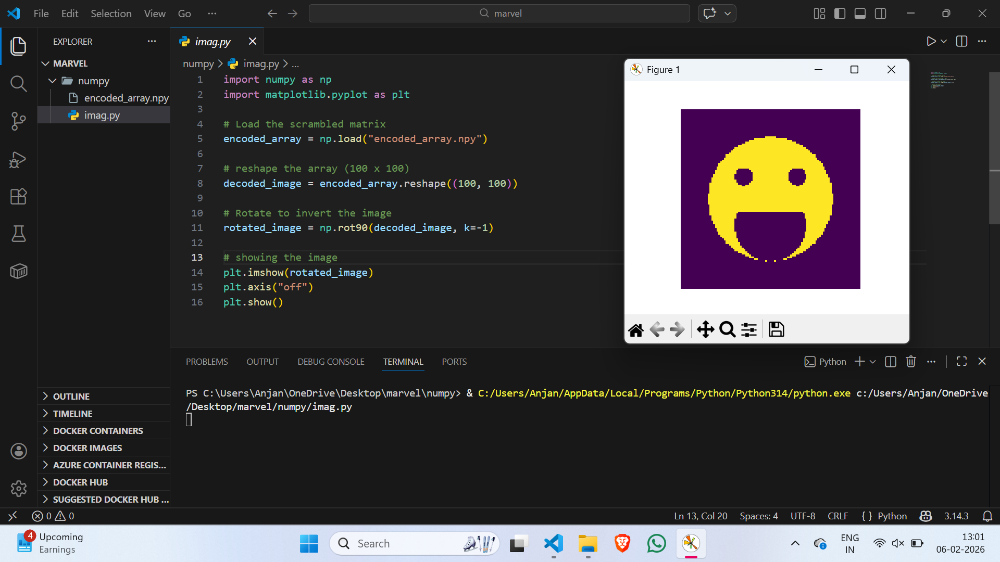

---

## TASK 7 — Portfolio Webpage

### Overview
Created a responsive personal portfolio website.

### Features
- About section and profile details
- Project showcase
- Social media links
- Responsive design for different screen sizes
- Custom styling

### Deployment
- Version controlled using GitHub
- Hosted using vercel platform
[Portfolio](https://anjan-github-io-git-main-anjans-projects-d060d631.vercel.app/)
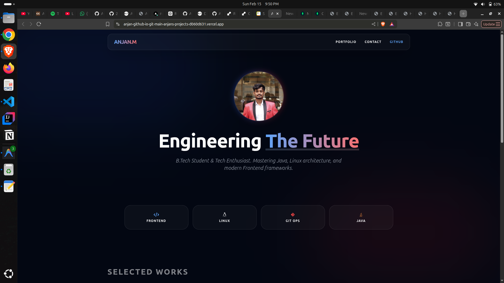
---
## TASK 8 — Writing Resource Article using Markdown

### Overview
Learned Markdown syntax and created a technical article on Linux.

### Work Done
- Structured article using headings and lists
- Added links and formatted sections
- Ensured readability across devices
- Published article on the MARVEL platform
[linux md](task8/linux-complete-guide.md)
---

##  TASK 9 — Tinkercad

### Overview
Simulated circuits to understand sensors and microcontroller programming.

### Projects
- Ultrasonic sensor distance measurement
- Serial monitor output display
- Radar system using ultrasonic sensor + servo motor
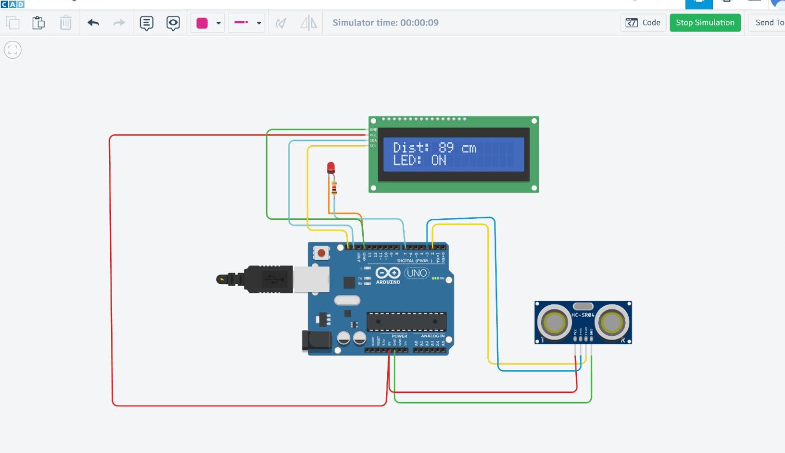

---

## TASK 10 — Speed Control of DC Motor

### Overview
Controlled DC motor speed using Arduino and an H-Bridge motor driver.

I learnt the basics of the L298 Motor driver, about its ports and connections. Learnt how to use ARDUINO to control the speed of the DC Motor by doing the appropriate connections with the L298N Motor Driver.
### Key Concepts
- L298N motor driver operation
- Hardware implementation and testing
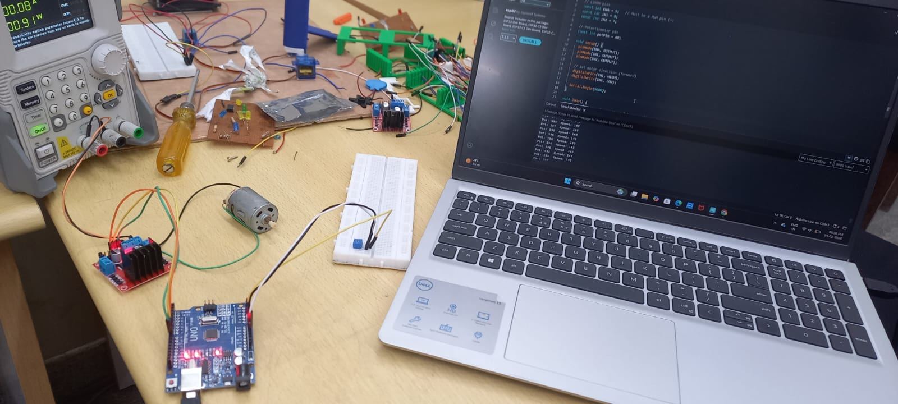
[watch-video](https://drive.google.com/file/d/1cR2iuDeJmmP0Sag2VTzNXopN98Yh5x-P/view?usp=drivesdk)

---

## TASK 11 — LED Toggle Using ESP32

### Overview
The primary goal is to fabricate a functional web server capable of controlling two LEDs connected to the GPIO pins of the ESP32. This web server will be readily accessible by inputting the ESP32’s IP address into any browser within the local network. The web interface will be equipped with ON/OFF buttons, providing an intuitive means of managing the LED states.  
This is just a simple example to build a web server that controls ESP32 outputs pins. here we are using LED for executing this project.

### Key Activities
- Configured Arduino IDE for ESP32
- Connected LED to GPIO
- Created browser-based control interface
- Controlled LED through local network
 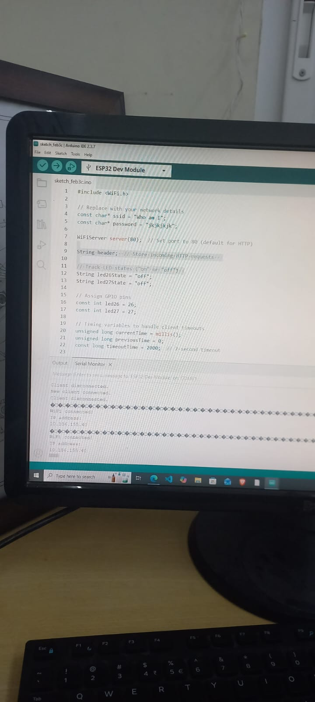
 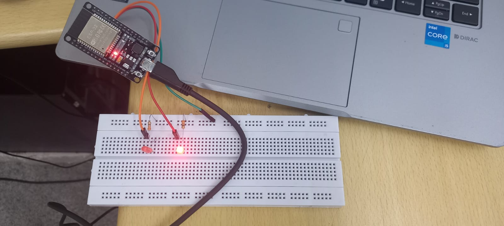

---

##  TASK 12 — Soldering Prerequisites

### Overview
-Soldering is a technique used to join electronic components by melting a filler metal (solder) that solidifies to form both a mechanical and electrical connection. It is widely used in assembling and repairing circuits, and can be seen as the small metallic joints on PCBs where components are fixed. 
-In the lab, I was introduced to the basic soldering equipment including the soldering iron, solder wire, flux, soldering wick, and the stand, along with the necessary safety precautions. Under the guidance of a coordinator, I practiced basic soldering on a perf board by creating a simple LED circuit.
- I also learned how to desolder existing joints using a soldering wick and then resolder the components back in place.
---

## TASK 14 — Karnaugh Maps & Logic Circuit

### Overview
In this task, I learned how to use Karnaugh Maps to simplify Boolean expressions and design a simple burglar alarm circuit.   The burglar alarm should work based on the whether the **door is locked or open**, whether the **key is pressed or not pressed**. By using these conditions on a 4-variable K-Map, I identified the simplified Boolean expression for the output. This logic was then used to design a circuit using logic gates
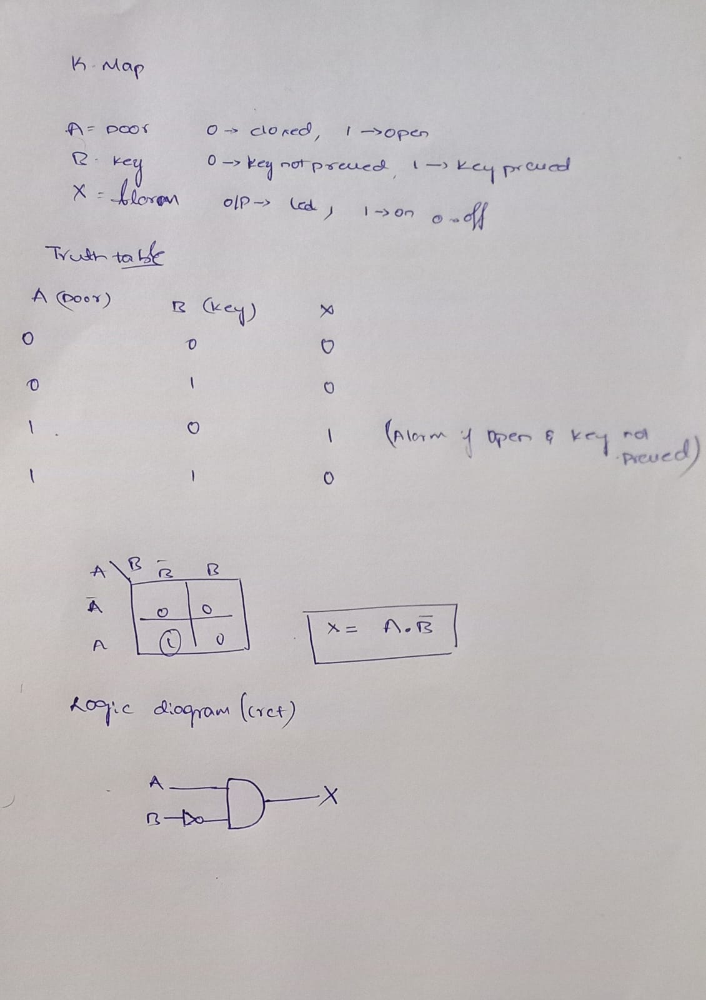
 
---

##  TASK 15 — Active Participation

### Activities
### Synthetic intelligence
i actively participated in a Synthetic Intelligence event where I used AI tools to design a prototype drone concept. The project focused on applying artificial intelligence for innovative design and problem-solving during the prototyping phase. My design stood out for its creativity and practical approach, and I won recognition in the event.
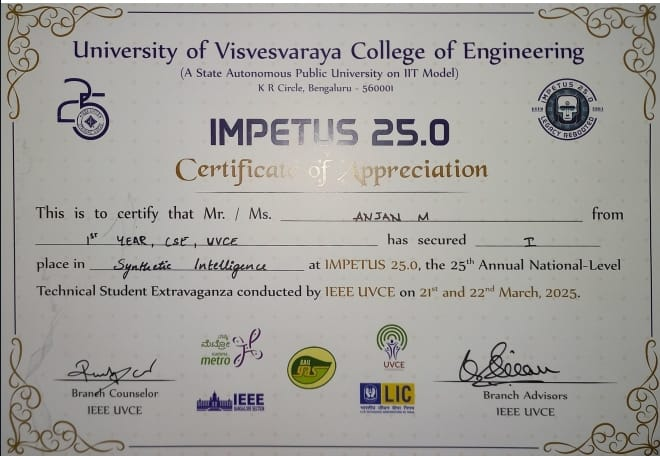

### Bit N Build
  I actively participated in the **Bit N Build Hackathon**, where I designed and developed a College Management System prototype. The project focused on creating an efficient digital solution to manage academic and administrative activities within a college.
 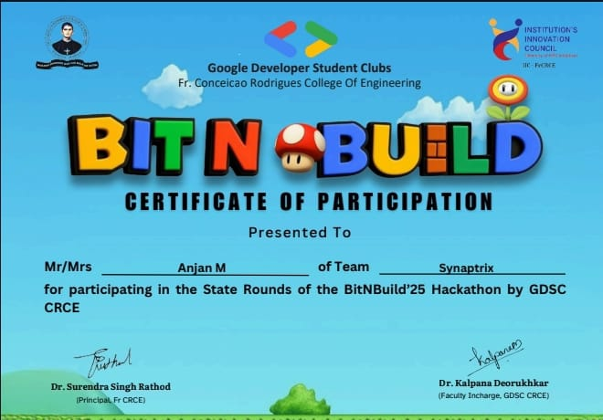
 
---
##  TASK 17 — Introduction to VR

### Overview
Studied Virtual Reality and its ecosystem.

### Topics Covered
- Difference between VR and AR
- Current industry trends
- Technology stacks
- Indian companies working in VR
[vr.md](vr/vr.md)

##  TASK 18 — Sad Servers (Linux Troubleshooting)

### Overview
In this task, I worked on a **Linux troubleshooting challenge** called _Sad Servers_. The scenario was a “Command Line Murder Mystery,” where I had to investigate a crime using only Linux commands.
Helped me to practice Linux debugging through real-world scenarios.

### Skills Developed
- Problem diagnosis using command line
- System troubleshooting techniques
- Improving Linux confidence
 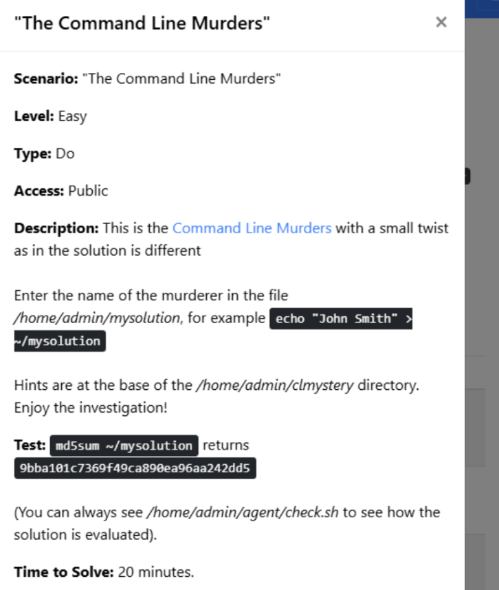
 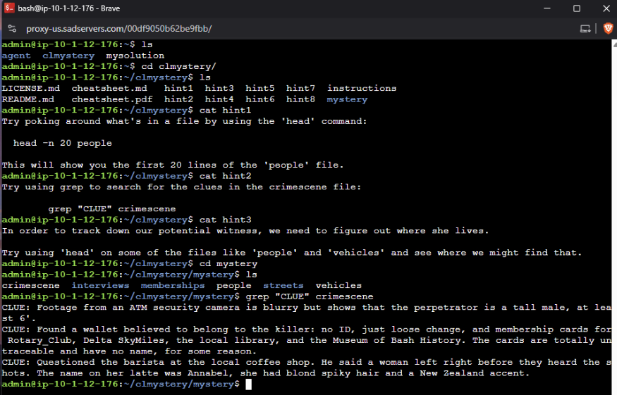
 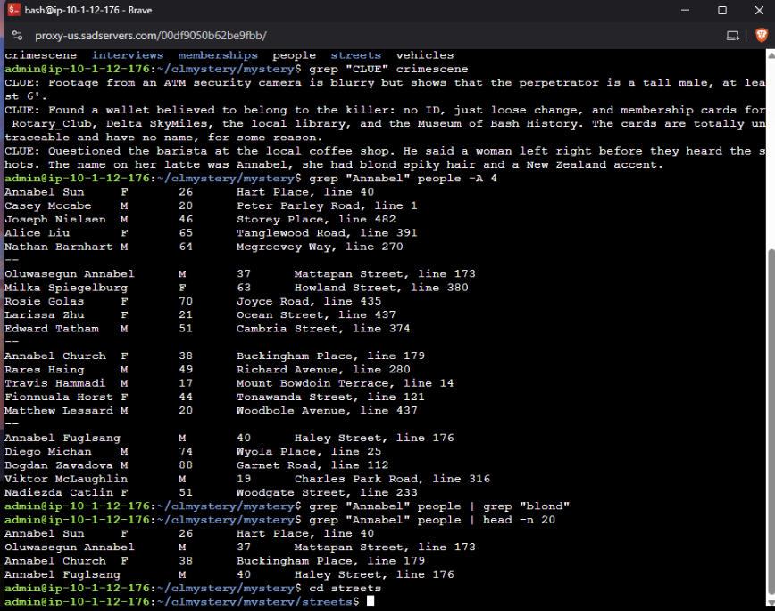
 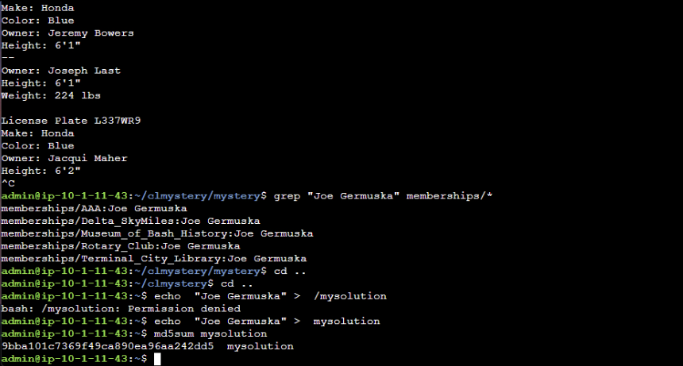
 
  
---

##  TASK 19 — Web App using Express

### Overview
Built a resource library web application using Express.js.

### Features
- Browse educational resources and books
- User account management
- Backend routing and server setup
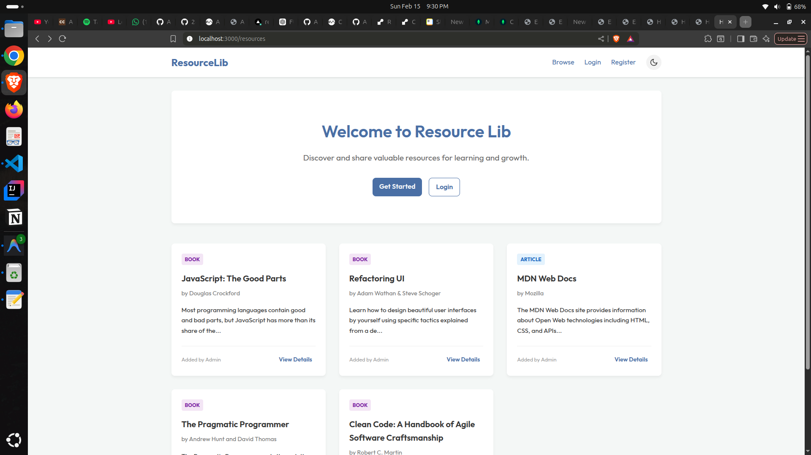
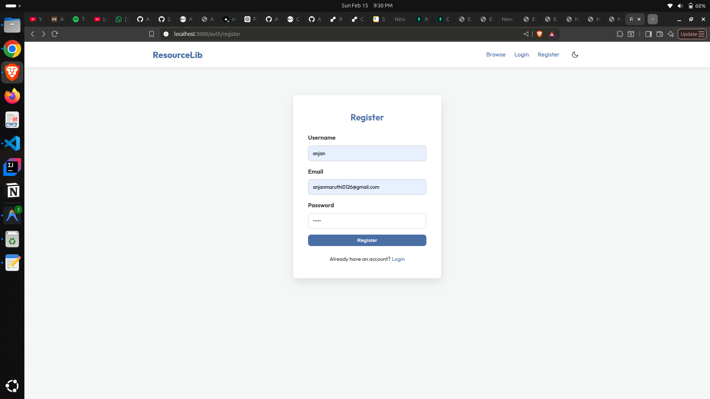
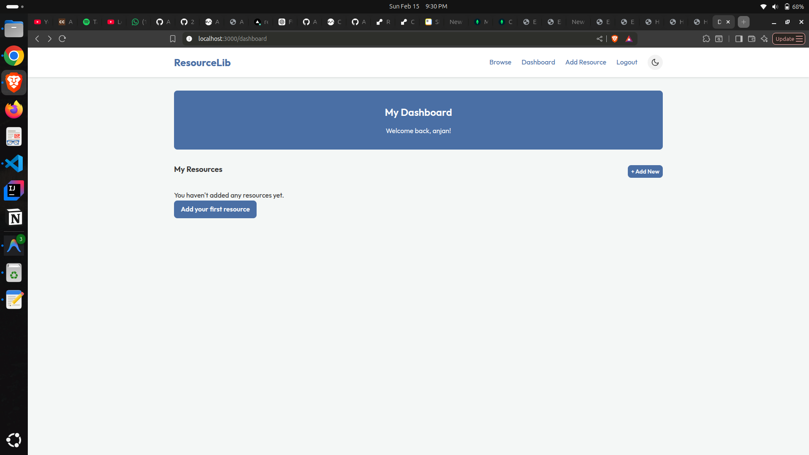
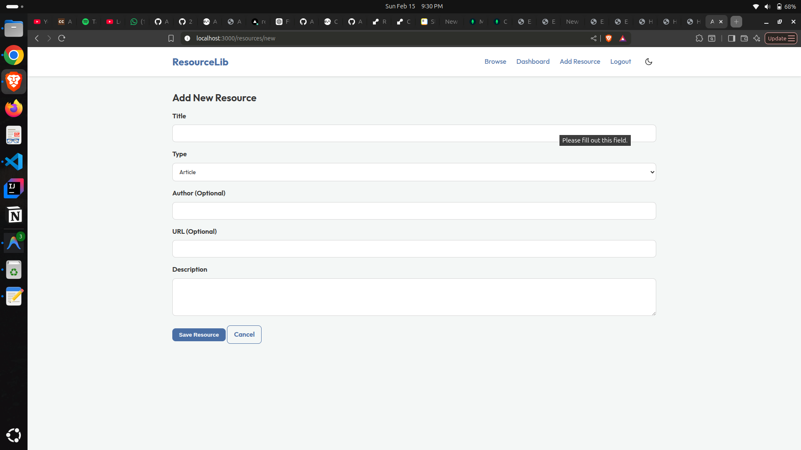

---

